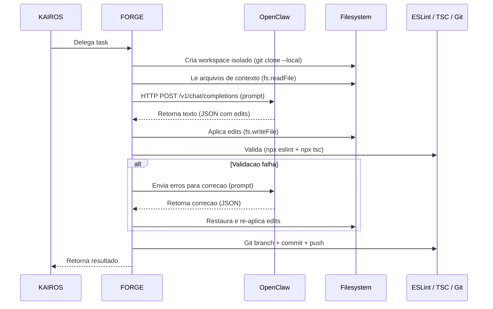
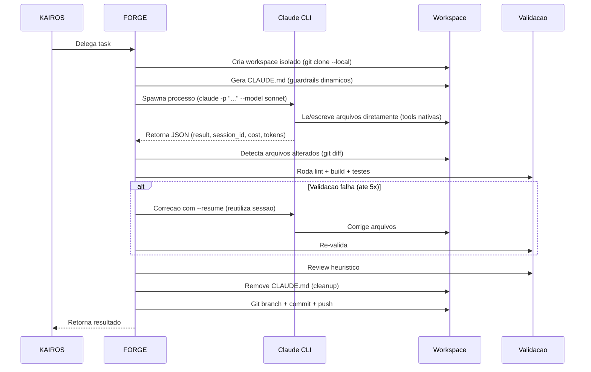

# connexto-axiom-agents


**Sistema operacional de execucao onde agentes de IA trabalham continuamente para avancar objetivos reais.**

connexto-axiom-agents e um sistema operacional de execucao com IA que orquestra agentes autonomos para planejar, executar, avaliar e aprender com tarefas reais — tudo rodando localmente com controle total de custo, governanca humana e loops de feedback rastreaveis.

---

## Arquitetura

```
src/main.ts          Entry point do ciclo Kairos (one-shot via cron)
src/bot.ts           Entry point do bot Telegram (long-polling persistente)
apps/api/            Dashboard API (NestJS)
apps/web/            Dashboard Frontend (Vite + React)
                              |
         ┌────────────────────┼────────────────────┐
         v                    v                    v
     KAIROS               FORGE                VECTOR
   (orquestrador)     (executor tecnico)   (executor marketing)
    gpt-5.2          multi-executor          gpt-4o-mini
         |                    |                    |
         |    ┌───────────────┤                    |
         v    v               v                    v
       NEXUS          ┌──────────────────┐   ┌──────────┐
    (pesquisador)     │ Executor Modes:  │   │ Artefatos│
    gpt-4o-mini       │  openclaw (HTTP) │   │ Drafts   │
         |            │  claude-cli (CLI)│   │ Publish  │
         v            │  legacy (agent)  │   └──────────┘
   ┌──────────┐       ├──────────────────┤         │
   │ Pesquisa │       │ Workspaces       │         │
   │ Analise  │       │ Git Branches     │         │
   └──────────┘       │ Code Changes     │         │
         │            └──────────────────┘         │
         └────────────────────┼────────────────────┘
                              v
                       SQLite (modo WAL)
                         |         |
                         v         v
              Telegram        Dashboard Web
          (Briefing Diario)   (Daily Report + Kanban)
```

## Agentes

| Agente       | Papel                                                                          | Modelo LLM                   | Status     |
| ------------ | ------------------------------------------------------------------------------ | ---------------------------- | ---------- |
| **KAIROS**   | Orquestrador estrategico — decide, delega e avalia com contexto historico      | `gpt-5.2`                   | Ativo      |
| **FORGE**    | Executor tecnico — multi-executor (openclaw, claude-cli, legacy) com validacao | `gpt-5.3-codex` / `claude`  | Ativo      |
| **NEXUS**    | Pesquisa tecnica — analisa opcoes, trade-offs e riscos                         | `gpt-4o-mini`               | Ativo      |
| **VECTOR**   | Executor de marketing — gera posts, newsletters, landing copy                  | `gpt-4o-mini`               | Ativo      |
| **QA**       | Validacao funcional — testes E2E hibridos (LLM + Playwright)                   | `gpt-4o-mini`               | Planejado  |
| **SENTINEL** | Monitor de seguranca e compliance                                              | —                            | Planejado  |
| **COVENANT** | Fiscalizador de governanca e politicas                                         | —                            | Planejado  |

## Modelo de Execucao

O FORGE suporta **tres modos de execucao** (executor modes), configurados por projeto via `forge_executor` no manifest:

| Modo | Descricao | Backend LLM | Como funciona |
| ---- | --------- | ----------- | ------------- |
| `openclaw` | HTTP tool loop via gateway OpenClaw | gpt-5.3-codex | axiom-agents envia prompts, recebe JSON com edits, aplica no filesystem |
| `claude-cli` | Autonomo via Claude CLI (Anthropic) | claude sonnet/haiku | Claude CLI opera direto no workspace com tools nativas (Edit, Write, Bash) |
| `legacy` | Agent loop interno (3 fases) | gpt-5.3-codex | Plan → Edit → Correct loop com ate 4 iteracoes |

### Modo OpenClaw (padrao)

O OpenClaw **nao executa tarefas**. Ele e exclusivamente um **gateway de LLM** com API OpenAI-compatible (`/v1/chat/completions`) que recebe prompts e retorna texto (JSON ou Markdown). Toda execucao real — escrita de arquivos, lint, build, git — e feita pelo **axiom-agents**.



### Modo Claude CLI

O Claude CLI opera **diretamente no workspace** com suas tools nativas (Edit, Write, Bash, Read, Glob, Grep). O axiom-agents gera um `CLAUDE.md` dinamico com guardrails, spawna o processo `claude`, e apos a execucao roda validacao + review heuristico com ciclos de correcao automaticos.



**Otimizacoes de custo do modo Claude CLI:**

- `--resume` para ciclos de correcao (reutiliza prompt caching da sessao anterior)
- Tracking cumulativo de custo com teto configuravel (`CLAUDE_CLI_MAX_TOTAL_COST_USD`)
- Modelo `haiku` para tasks do tipo FIX (mais barato que `sonnet`)
- Prompt caching nativo do Claude CLI para prefixos longos de contexto
- Repo index truncado (3000 chars max, omitido para tasks FIX)

> Documentacao detalhada do fluxo: [`docs/claude-cli-executor-flow.md`](docs/claude-cli-executor-flow.md)

### Responsabilidades

| Responsabilidade               | OpenClaw mode                  | Claude CLI mode                |
| ------------------------------ | ------------------------------ | ------------------------------ |
| Receber prompt, retornar texto | OpenClaw (gateway HTTP de LLM) | Claude CLI (processo local)    |
| Escrever/modificar arquivos    | axiom-agents (`fs`)            | Claude CLI (tools nativas)     |
| ESLint, TypeScript, build      | axiom-agents (`child_process`) | axiom-agents (`child_process`) |
| Git (branch, commit, push)     | axiom-agents (`child_process`) | axiom-agents (`child_process`) |
| Validacao e review             | axiom-agents                   | axiom-agents                   |
| Audit trail (SQLite)           | axiom-agents                   | axiom-agents                   |

> **Resumo:** OpenClaw = LLM gateway. Claude CLI = executor autonomo local. axiom-agents = orquestra tudo, valida e commita.

## Evolucao

| Fase  | Nome                                | Descricao                                                                 | Status |
| ----- | ----------------------------------- | ------------------------------------------------------------------------- | ------ |
| 12    | Execucao Controlada do FORGE        | FORGE executa tarefas reais em sandbox com permissoes                     | Feito  |
| 13    | Integracao OpenClaw                 | Runtime de execucao LLM via OpenClaw com hardening                        | Feito  |
| 14    | Feedback Loop Automatico            | Sistema aprende com resultados, ajusta scores de decisao                  | Feito  |
| 15    | Execucao Real do VECTOR             | Agente de marketing gera drafts via OpenClaw                              | Feito  |
| 16    | Aprovacao e Publicacao Semi-Auto    | Bot Telegram para aprovacao humana + publicacao stub                      | Feito  |
| 17    | Metricas de Marketing e Feedback    | Metricas de engajamento influenciam decisoes do KAIROS                    | Feito  |
| 18    | Codificacao Governada               | FORGE modifica codigo com ciclo PR virtual                                | Feito  |
| 22    | Pesquisa Tecnica NEXUS              | Agente de pesquisa reduz incerteza antes da codificacao                   | Feito  |
| 23.1  | Manifesto Multi-Projeto             | Manifestos de projeto, isolamento por project_id, estrutura               | Feito  |
| 23.2  | FORGE por Projeto                   | FORGE le codigo real, gera diffs, faz push de branches para review        | Feito  |
| 24    | Contexto Historico do KAIROS        | Dados historicos de execucao injetados no prompt do KAIROS                | Feito  |
| 25    | Governanca Explicita de Decisao     | Classificacao pre-decisao, selecao dinamica de modelo, log de governanca  | Feito  |
| 26    | Agente QA (Validacao Funcional)     | Testes E2E hibridos (LLM gera + Playwright executa) com retroalimentacao | Planejado |
| 27    | FORGE Agent Loop Hibrido            | 3 fases (Planning + Execution + Correction Loop) com ate 4 correcoes     | Feito     |
| 28    | Hardening Infra OpenClaw            | Classificacao de erros, retry transparente, healthcheck, trace_id E2E    | Feito     |
| 29    | Dashboard Web                       | NestJS API + React SPA: Daily Report, Kanban, gestao de agentes          | Em andamento |
| 30    | FORGE Multi-Executor + Claude CLI   | Executor autonomo via Claude CLI com guardrails, resume, cost ceiling    | Feito        |

## Funcionalidades Principais

- **Previsibilidade de Custo** — Orcamento rigido de tokens com limites mensais, por agente, por task e kill switch
- **Compressao de Prompts** — Prompts minimalistas dirigidos por estado, templates estritos, limites rigidos de tokens
- **Feedback Loops** — Feedback de execucao (SUCCESS/PARTIAL/FAILURE) + feedback de marketing (STRONG/AVERAGE/WEAK) ajustam scores de decisao automaticamente
- **Contexto Historico** — KAIROS recebe historico agregado (taxas de sucesso, falhas frequentes, arquivos arriscados) para decisoes informadas
- **Governanca de Decisao** — Classificacao pre-decisao em 4 eixos (complexidade, risco, custo, historico) para selecao dinamica de modelo LLM e thresholds de aprovacao
- **Suporte Multi-Projeto** — Manifestos de projeto com workspaces isolados, governanca e rastreamento de budget por projeto
- **Modificacao de Codigo Real** — FORGE le codigo-fonte real, gera diffs search/replace, faz push de branches para revisao humana
- **Multi-Executor FORGE** — Tres modos de execucao por projeto (openclaw, claude-cli, legacy) com selecao automatica de modelo por tipo de task
- **Pesquisa Tecnica** — Agente NEXUS pesquisa opcoes, trade-offs e riscos antes do FORGE executar tarefas de codigo
- **Governanca Humana** — Todas as publicacoes e mudancas de codigo de alto risco exigem aprovacao explicita via Telegram
- **Inteligencia de Marketing** — Metricas stub/manuais com avaliador; deteccao de tipos de mensagem fortes/fracas retroalimenta a orquestracao
- **Hardening de Seguranca** — Sanitizacao de output, execucao em sandbox, audit logging, prevencao de SSRF, isolamento de workspaces

## Stack Tecnologica

| Componente         | Tecnologia                          |
| ------------------ | ----------------------------------- |
| Runtime            | Node.js >= 24 + TypeScript 5.9      |
| Banco de Dados     | SQLite (modo WAL, better-sqlite3)   |
| Gateway LLM        | OpenClaw (gateway HTTP de LLM — apenas chat completions, sem execucao) |
| Executor CLI       | Claude CLI (Anthropic — execucao autonoma direta no workspace)         |
| Provedores LLM     | OpenAI (gpt-5.2, gpt-5.3-codex, gpt-4o-mini), Anthropic (claude sonnet, claude haiku) |
| Controle de Versao | Git (workspaces isolados, branch por task) |
| Agendamento        | Cron (ciclos one-shot)              |
| Interface Humana   | Bot Telegram (long-polling)         |
| Dashboard API      | NestJS 10 + better-sqlite3          |
| Dashboard Frontend | Vite 6 + React 19 + Tailwind CSS 4 + shadcn/ui |
| Monorepo           | Turborepo + pnpm workspaces         |
| Logging            | Pino (JSON estruturado)             |
| Linting            | ESLint 9 + Prettier 3               |

## Tabelas do Banco de Dados

| Tabela                 | Finalidade                                                |
| ---------------------- | --------------------------------------------------------- |
| `goals`                | Objetivos estrategicos ativos                             |
| `tasks`                | Tarefas vinculadas a goals                                |
| `decisions`            | Historico de decisoes do KAIROS                           |
| `metrics`              | Metricas genericas de agentes                             |
| `outcomes`             | Resultados de execucao com dados de tempo/tokens/tamanho  |
| `audit_log`            | Trilha de auditoria de seguranca                          |
| `budgets`              | Orcamentos mensais de tokens                              |
| `token_usage`          | Rastreamento granular de tokens por agente                |
| `agent_feedback`       | Avaliacoes de execucao (SUCCESS/PARTIAL/FAILURE)          |
| `artifacts`            | Drafts de conteudo com workflow de aprovacao               |
| `publications`         | Registros de artefatos publicados                         |
| `marketing_metrics`    | Dados de engajamento (stub/manual/api)                    |
| `marketing_feedback`   | Avaliacoes de performance de conteudo (STRONG/AVERAGE/WEAK) |
| `code_changes`         | Mudancas de codigo do FORGE com ciclo PR virtual          |
| `pull_requests`        | Pull requests vinculadas a code_changes                   |
| `nexus_research`       | Pesquisas tecnicas com analise estruturada                |
| `projects`             | Manifestos de projetos registrados com estado de runtime  |
| `governance_decisions` | Log de decisoes de governanca com classificacao e modelo  |

## Estrutura do Projeto

```
apps/                Dashboard Web (monorepo via Turborepo)
  api/               NestJS REST API (le/escreve no mesmo SQLite)
  web/               Vite + React SPA (Daily Report, Kanban, Agents)
agents/              Configs de agentes, system prompts, memoria
  kairos/            Orquestrador (gpt-5.2)
  forge/             Executor tecnico (multi-executor)
  nexus/             Pesquisador tecnico (gpt-4o-mini)
  vector/            Executor de marketing (gpt-4o-mini)
  sentinel/          Monitor de seguranca (planejado)
  covenant/          Fiscalizador de governanca (planejado)
config/              Limites de budget, configuracao de logger
docs/                Documentacao tecnica (fluxos, arquitetura)
evaluation/          Avaliadores de execucao, marketing e NEXUS
execution/           Executores FORGE/VECTOR/NEXUS, sistema de codigo por projeto, sandbox
  forge/             Executores do FORGE:
    openclawAutonomousExecutor   Modo openclaw (HTTP tool loop via gateway)
    claudeCliExecutor            Modo claude-cli (autonomo via Claude CLI)
    claudeCliInstructions        Gerador dinamico de CLAUDE.md (guardrails)
    forgeAgentLoop               Modo legacy (plan → edit → correct)
    openclawValidation           Ciclo de validacao (lint, build, testes)
    openclawReview               Review heuristico dos arquivos alterados
  project/           Codigo por projeto: executor, applier, git manager, security, workspace
  nexus/             Executor e validador NEXUS
  discovery/         File discovery e repository indexer
interfaces/          Telegram sender + bot (long-polling)
llm/                 Cliente LLM com failover (OpenAI + Claude)
orchestration/       Ciclo Kairos, filtro de decisao, ajustadores de feedback, briefing
  historicalContext   Formatacao de dados historicos para prompt do KAIROS
  decisionGovernance Classificacao pre-decisao e selecao de politica de governanca
projects/            Manifestos de projetos e suporte multi-projeto
  default/           Projeto padrao (retrocompatibilidade)
  <project-id>/      Diretorios por projeto (manifest.yaml com forge_executor)
runtime/openclaw/    Configs de agentes e skills do OpenClaw
scripts/             Bootstrap, cron runner, seed data, register-project
services/            Servico de aprovacao, coletor de metricas, servico de code changes
shared/policies/     Politicas cross-projeto (limites de risco, paths permitidos)
src/                 Entry points (main.ts, bot.ts)
state/               Schema SQLite, migrations, modulos CRUD de todas as tabelas
  executionHistory   Agregacao historica para decisoes do KAIROS
  governanceLog      Log de decisoes de governanca
workspaces/          Clones Git isolados temporarios para execucao do FORGE (gitignored)
```

## Dashboard Web

O projeto inclui um dashboard web para gestao visual dos agentes, composto por uma **API NestJS** e um **SPA React**.

```
apps/
  api/    NestJS — REST API que le/escreve no mesmo SQLite (state/local.db)
  web/    Vite + React 19 + Tailwind CSS + shadcn/ui — SPA mobile-first
```

### Stack do Dashboard

| Componente | Tecnologia |
| ---------- | ---------- |
| API | NestJS 10 + better-sqlite3 (mesmo driver do axiom-agents) |
| Frontend | Vite 6 + React 19 + TypeScript 5 |
| Estilo | Tailwind CSS 4 + shadcn/ui + Radix UI |
| Data fetching | TanStack Query 5 |
| Roteamento | React Router 6 |
| Monorepo | Turborepo (turbo) + pnpm workspaces |

### Paginas

- **Daily Report** — versao visual do briefing do Telegram: cards de metricas (success rate por agente, budget), timeline do ultimo ciclo, pendentes com botoes de aprovar/rejeitar, grafico de historico 7 dias, botao "Rodar Ciclo"
- **Kanban Board** — goals organizadas em colunas por status (Backlog, Active, In Progress, Done, Failed) com drag-and-drop. Criar goals direto pela UI
- **Agents** — card por agente com success rate, tokens consumidos, alertas. Expandir para ver historico de execucoes e editar configuracoes

### Iniciar o Dashboard

```bash
# API + Frontend juntos (via Turborepo)
pnpm dev:dashboard

# Ou separadamente
pnpm dev:api    # NestJS na porta 3200
pnpm dev:web    # Vite na porta 5173 (com proxy para API)
```

### Endpoints Principais da API

| Metodo | Endpoint | Descricao |
| ------ | -------- | --------- |
| GET | `/dashboard/summary` | Payload completo do daily report |
| GET | `/goals` | Listar goals (filtro: status, project_id) |
| POST | `/goals` | Criar goal |
| PATCH | `/goals/:id` | Atualizar status/prioridade |
| DELETE | `/goals/:id` | Remover goal |
| GET | `/outcomes` | Listar execucoes (filtro: agent, status, trace_id) |
| GET | `/code-changes?status=pending_approval` | Changes pendentes |
| POST | `/code-changes/:id/approve` | Aprovar code change |
| POST | `/code-changes/:id/reject` | Rejeitar code change |
| GET | `/artifacts?status=draft` | Drafts pendentes |
| POST | `/artifacts/:id/approve` | Aprovar draft |
| POST | `/artifacts/:id/reject` | Rejeitar draft |
| POST | `/cycle/run` | Disparar ciclo KAIROS |
| GET | `/agents` | Listar agentes com stats |
| PATCH | `/agents/:id/config` | Editar config do agente |

---

## Guia Completo: Da Instalacao ate a Primeira Task

### 1. Pre-requisitos

- **Node.js >= 24** (use [nvm](https://github.com/nvm-sh/nvm) — o projeto inclui `.nvmrc`)
- **pnpm** (gerenciador de pacotes)
- **Git** (para workspaces do FORGE)
- **ripgrep** (obrigatorio para indexacao de repositorio e busca de conteudo do FORGE)
- **OpenClaw** (runtime de execucao LLM — necessario para `forge_executor: openclaw`)
- **Claude CLI** (Anthropic — necessario para `forge_executor: claude-cli`)
- **Bot Telegram** (para receber briefings e aprovar drafts — opcional)

```bash
# Instalar ripgrep (obrigatorio para FORGE)
sudo apt install ripgrep

# Instalar Claude CLI (necessario para forge_executor: claude-cli)
npm install -g @anthropic-ai/claude-code

# Instalar pnpm se necessario
corepack enable && corepack prepare pnpm@latest --activate

# Usar a versao correta do Node.js (se usar nvm)
nvm use
```

### 2. Bootstrap (instalacao e banco de dados)

```bash
# Clonar o repositorio
git clone <url-do-repo> connexto-axiom-agents
cd connexto-axiom-agents

# Rodar o bootstrap (instala deps + cria banco SQLite)
./scripts/bootstrap.sh
```

O bootstrap faz:
- Verifica Node.js >= 24 e pnpm
- Instala dependencias via `pnpm install`
- Cria o banco SQLite em `state/local.db` com todas as tabelas

### 3. Configurar variaveis de ambiente

```bash
cp .env.example .env
```

Edite o `.env` com suas credenciais:

```env
# === LLM (obrigatorio — pelo menos um provedor) ===
OPENAI_API_KEY=sk-...                   # Para KAIROS (gpt-5.2) e NEXUS (gpt-4o-mini)

# === OpenClaw (necessario para FORGE e VECTOR) ===
USE_OPENCLAW=true                        # Ativar execucao via OpenClaw
OPENCLAW_ENDPOINT=http://localhost:18789 # Endpoint do gateway OpenClaw
OPENCLAW_API_KEY=dev-local               # Token de autenticacao
OPENCLAW_MODEL=gpt-4o-mini              # Modelo padrao do OpenClaw

# === Telegram (opcional — para briefings e aprovacoes) ===
TELEGRAM_BOT_TOKEN=123456:ABC...         # Token do @BotFather
TELEGRAM_CHAT_ID=-100...                 # ID do chat/grupo

# === Budget (ajuste conforme necessario) ===
BUDGET_MONTHLY_TOKENS=500000             # Limite mensal total
BUDGET_PER_TASK_TOKENS=50000             # Limite por task
BUDGET_MAX_TASKS_DAY=10                  # Max tasks por dia

# === KAIROS ===
KAIROS_MAX_OUTPUT_TOKENS=4096            # Tokens de saida para modelos de raciocinio

# === FORGE ===
FORGE_MAX_CORRECTION_ROUNDS=4            # Tentativas de correcao (0-10)
FORGE_CONTEXT_MAX_CHARS=20000            # Maximo de chars de contexto por task

# === Claude CLI (necessario para forge_executor: claude-cli) ===
CLAUDE_CLI_PATH=claude                   # Caminho do binario (default: claude)
CLAUDE_CLI_MODEL=sonnet                  # Modelo principal (sonnet, opus, etc.)
CLAUDE_CLI_FIX_MODEL=haiku              # Modelo para tasks FIX (mais barato)
CLAUDE_CLI_MAX_TURNS=25                  # Max turns por execucao
CLAUDE_CLI_TIMEOUT_MS=300000             # Timeout total (5 min)
CLAUDE_CLI_MAX_BUDGET_USD=5              # Budget por execucao individual
CLAUDE_CLI_MAX_TOTAL_COST_USD=10         # Teto de custo acumulado (todos os ciclos)

# === GitHub (opcional — para PRs automaticos) ===
GITHUB_TOKEN=ghp_...                     # Token com permissao de repo
GITHUB_REPO=owner/repo                   # Repositorio para PRs
```

> **Minimo para funcionar:** `OPENAI_API_KEY` + `USE_OPENCLAW=true` com OpenClaw rodando (modo openclaw), ou `OPENAI_API_KEY` + Claude CLI instalado (modo claude-cli).

### 4. Registrar um projeto

O FORGE precisa de um projeto registrado com manifesto para saber qual repositorio trabalhar.

```bash
# Registrar um novo projeto
pnpm tsx scripts/register-project.ts meu-projeto
```

Isso cria a estrutura em `projects/meu-projeto/` com um `manifest.yaml` template.

Edite o manifesto para configurar o projeto:

```yaml
# projects/meu-projeto/manifest.yaml
project_id: meu-projeto
repo_source: /caminho/absoluto/para/o/repositorio  # Path local do repo Git
stack:
  language: typescript
  framework: nextjs                                  # nestjs, nextjs, nestjs-nextjs-turbo, etc.
risk_profile: medium                                 # low, medium, high
autonomy_level: 2                                    # 1 (minimo) a 5 (maximo)
token_budget_monthly: 200000                         # Orcamento mensal para este projeto
status: active                                       # active, paused, archived
forge_executor: claude-cli                           # openclaw, claude-cli ou legacy
```

| Campo                  | Descricao                                                    |
| ---------------------- | ------------------------------------------------------------ |
| `project_id`           | Identificador unico (kebab-case, ex: `meu-saas`)            |
| `repo_source`          | Caminho absoluto do repositorio Git local                    |
| `stack.language`       | Linguagem principal (`typescript`, `python`, etc.)           |
| `stack.framework`      | Framework (`nestjs`, `nextjs`, `nestjs-nextjs-turbo`, etc.)  |
| `risk_profile`         | Perfil de risco (`low`, `medium`, `high`)                    |
| `autonomy_level`       | Nivel de autonomia do FORGE (1 = conservador, 5 = agressivo)|
| `token_budget_monthly` | Orcamento de tokens mensal para este projeto                 |
| `status`               | `active` para o FORGE trabalhar, `paused` para pausar        |
| `forge_executor`       | Modo de execucao: `openclaw`, `claude-cli` ou `legacy` (padrao: `legacy`) |

> **Importante:** O `repo_source` deve apontar para um repositorio Git valido. O FORGE **nunca** modifica o repo original — ele clona para um workspace isolado.

### 5. Criar um Goal (objetivo estrategico)

Goals sao objetivos de alto nivel que o KAIROS usa para decidir quais tarefas delegar aos agentes.

```bash
# Criar um goal para o projeto
pnpm tsx scripts/seed-goal.ts --project meu-projeto "Implementar autenticacao OAuth2"
```

Parametros:
- `--project <project-id>` — ID do projeto (padrao: `connexto-digital-signer`)
- O ultimo argumento e o titulo do goal (padrao: `"Launch MVP"`)

Exemplos:

```bash
# Goal para refatorar o sidebar
pnpm tsx scripts/seed-goal.ts --project meu-projeto "Remover item signatarios do sidebar"

# Goal para adicionar testes
pnpm tsx scripts/seed-goal.ts --project meu-projeto "Adicionar testes unitarios para o modulo de auth"

# Goal para otimizar performance
pnpm tsx scripts/seed-goal.ts --project meu-projeto "Otimizar queries N+1 no endpoint de listagem"
```

> O KAIROS analisa os goals ativos e decide automaticamente quais tarefas delegar para FORGE, NEXUS e VECTOR a cada ciclo.

### 6. Iniciar o sistema

```bash
# Modo desenvolvimento (um ciclo com hot-reload + logs formatados)
pnpm dev
```

O que acontece em cada ciclo:
1. **KAIROS** carrega goals ativos e historico de execucoes
2. **Governanca** classifica complexidade, risco e custo, seleciona o modelo LLM
3. **KAIROS** decide delegacoes (FORGE para codigo, NEXUS para pesquisa, VECTOR para marketing)
4. **NEXUS** executa pesquisas pre-execucao (se necessario)
5. **FORGE** executa tarefas de codigo: planeja, gera edits, corrige erros iterativamente
6. **VECTOR** gera drafts de conteudo
7. **Feedback** avalia cada execucao (SUCCESS/FAILURE) e atualiza historico
8. **Briefing** envia resumo via Telegram

### 7. Acompanhar a execucao

Os logs mostram o progresso em tempo real:

```
INFO: Starting cycle... {"projectId":"meu-projeto"}
INFO: Governance policy selected {"selectedModel":"gpt-5.2"}
INFO: FORGE agent loop starting - Phase 1: Planning
INFO: FORGE agent loop - Phase 2: Execution
INFO: FORGE agent loop - Phase 3: Apply & Verify
INFO: FORGE agent loop - lint passed, edits verified
INFO: Cycle complete.
```

Quando o FORGE conclui com sucesso:
- Uma branch `forge/task-<id>` e criada no workspace
- As mudancas sao commitadas e pushed para o repositorio original
- Voce pode revisar e fazer merge via Pull Request

### 8. Bot Telegram (opcional)

```bash
# Em outro terminal
pnpm bot
```

Comandos disponiveis:

| Comando                                             | Descricao                                  |
| --------------------------------------------------- | ------------------------------------------ |
| `/drafts`                                           | Listar drafts pendentes de aprovacao       |
| `/approve <id>`                                     | Aprovar um draft                           |
| `/reject <id>`                                      | Rejeitar um draft                          |
| `/publish <id>`                                     | Publicar artefato aprovado (stub v1)       |
| `/metrics <id> <impressions> <clicks> <engagement>` | Registrar metricas de marketing manuais    |
| `/help`                                             | Mostrar comandos disponiveis               |

IDs podem ser parciais (primeiros 8 caracteres).

### 9. Executar via Cron (producao)

Para execucao autonoma diaria:

```bash
# Teste manual primeiro
./scripts/run-kairos.sh

# Registrar no cron (rodar todo dia as 07:00)
crontab -e
```

```
0 7 * * * /caminho/para/connexto-axiom-agents/scripts/run-kairos.sh >> /caminho/para/connexto-axiom-agents/logs/kairos.log 2>&1
```

Verificar:

```bash
crontab -l
```

Logs sao adicionados em `logs/kairos.log`. O Briefing Diario via Telegram e enviado automaticamente apos cada ciclo.

---

## Resumo Rapido

```bash
# 1. Instalar
./scripts/bootstrap.sh && cp .env.example .env

# 2. Configurar .env (OPENAI_API_KEY + OpenClaw ou Claude CLI)

# 3. Registrar projeto
pnpm tsx scripts/register-project.ts meu-projeto
# Editar projects/meu-projeto/manifest.yaml:
#   repo_source, stack, status: active
#   forge_executor: claude-cli  (ou openclaw / legacy)

# 4. Criar goal
pnpm tsx scripts/seed-goal.ts --project meu-projeto "Minha primeira tarefa"

# 5. Rodar
pnpm dev
```

---

## Scripts

| Script                  | Descricao                                              |
| ----------------------- | ------------------------------------------------------ |
| `pnpm dev`              | Rodar ciclo Kairos com hot-reload e logs formatados    |
| `pnpm bot`              | Iniciar bot Telegram (long-polling persistente)        |
| `pnpm dev:dashboard`    | Iniciar Dashboard (API + Frontend via Turborepo)       |
| `pnpm dev:api`          | Iniciar apenas a API NestJS (porta 3200)               |
| `pnpm dev:web`          | Iniciar apenas o frontend React (porta 5173)           |
| `pnpm build:dashboard`  | Compilar Dashboard (API + Frontend)                    |
| `pnpm lint:dashboard`   | Lint do Dashboard (API + Frontend)                     |
| `pnpm build`            | Compilar TypeScript (agentes)                          |
| `pnpm start`            | Rodar output compilado                                 |
| `pnpm lint`             | Verificar erros de linting                             |
| `pnpm lint:fix`         | Corrigir erros de linting automaticamente              |
| `pnpm format`           | Formatar todos os arquivos                             |
| `pnpm format:check`     | Verificar formatacao                                   |
