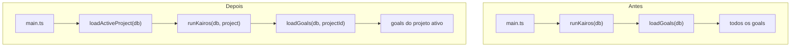

# FASE 23.1 -- Manifesto de Projeto e Estrutura Base

## Overview

Implementar a Fase 1 da FASE 23: estrutura base de multi-projeto com manifesto obrigatorio, tabela de projetos no SQLite, CRUD de projetos, script de registro, e validacao de que nenhum goal existe sem project_id. Camada adicionada sobre a arquitetura existente, sem mover arquivos.

## Principio

Adicionar suporte a multiplos projetos como **camada sobre a arquitetura existente**. Nenhum arquivo e movido, nenhum import e quebrado. O conceito de `project_id` e introduzido progressivamente nas tabelas e fluxos.

## O que muda



## Arquivos a Criar

### 1. `projects/manifest.schema.ts` -- Schema e tipos do manifesto

Define a interface `ProjectManifest` com todos os campos obrigatorios, a funcao de validacao `validateManifest`, e os tipos auxiliares:

```typescript
export interface ProjectManifest {
  readonly projectId: string;
  readonly repoSource: string;
  readonly stack: {
    readonly language: string;
    readonly framework: string;
  };
  readonly riskProfile: "low" | "medium" | "high";
  readonly autonomyLevel: 1 | 2 | 3;
  readonly tokenBudgetMonthly: number;
  readonly status: "active" | "maintenance" | "paused";
}
```

Validacao rigorosa: `projectId` kebab-case, `tokenBudgetMonthly > 0`, `repoSource` nao vazio, etc.

### 2. `projects/manifestLoader.ts` -- Carregador de manifestos YAML

- Le `projects/<project_id>/manifest.yaml` do disco
- Parseia YAML usando dependencia `yaml` (a adicionar)
- Valida contra o schema
- Retorna `ProjectManifest` tipado
- Funcao `loadAllManifests()` que escaneia `projects/*/manifest.yaml`
- Funcao `loadManifest(projectId)` para projeto especifico

### 3. `state/projects.ts` -- CRUD para tabela `projects`

Tabela `projects` no SQLite espelha o manifesto com campos adicionais de runtime:

- `saveProject(db, manifest)` -- upsert baseado em `project_id`
- `getActiveProject(db)` -- retorna o projeto com `status = 'active'` (no maximo 1)
- `getAllProjects(db)` -- lista todos
- `getProjectById(db, projectId)` -- por ID
- `updateProjectStatus(db, projectId, status)` -- muda status
- `getProjectTokenUsage(db, projectId)` -- tokens consumidos no mes
- `syncProjectsFromManifests(db, manifests)` -- sincroniza manifestos do disco com a tabela

### 4. `scripts/register-project.ts` -- Script para registrar projeto

Script CLI que:
1. Recebe `projectId` como argumento
2. Cria a estrutura `projects/<projectId>/` com subdiretorios (`forge/`, `workspace/`, `state/`)
3. Gera `manifest.yaml` template com valores default
4. Instrui o usuario a editar o manifesto
5. Valida o manifesto apos edicao

Uso: `pnpm tsx scripts/register-project.ts meu-projeto`

### 5. `shared/policies/project-limits.ts` -- Limites por risk profile

Mapeia `riskProfile` para limites concretos:
- `low`: max risk 2, max 5 files/change, auto-approve
- `medium`: max risk 3, max 3 files/change, aprovacao para risk >= 3
- `high`: max risk 4, max 2 files/change, aprovacao para risk >= 2

### 6. `projects/default/manifest.yaml` -- Manifesto do projeto atual

Converter o projeto existente ("connexto-axiom" ou outro) em um projeto registrado com manifesto, para manter retrocompatibilidade. O `projectId` default sera `"default"`.

## Arquivos a Modificar

### 7. Tabela `projects` em `state/schema.sql`

```sql
CREATE TABLE IF NOT EXISTS projects (
  id                    TEXT PRIMARY KEY,
  project_id            TEXT NOT NULL UNIQUE,
  repo_source           TEXT NOT NULL,
  language              TEXT NOT NULL,
  framework             TEXT NOT NULL,
  risk_profile          TEXT NOT NULL CHECK (risk_profile IN ('low', 'medium', 'high')),
  autonomy_level        INTEGER NOT NULL CHECK (autonomy_level BETWEEN 1 AND 3),
  token_budget_monthly  INTEGER NOT NULL,
  status                TEXT NOT NULL DEFAULT 'active' CHECK (status IN ('active', 'maintenance', 'paused')),
  tokens_used_month     INTEGER NOT NULL DEFAULT 0,
  created_at            TEXT NOT NULL DEFAULT (strftime('%Y-%m-%dT%H:%M:%fZ', 'now')),
  updated_at            TEXT NOT NULL DEFAULT (strftime('%Y-%m-%dT%H:%M:%fZ', 'now'))
);
```

### 8. Coluna `project_id` em tabela `goals` em `state/schema.sql`

Adicionar coluna `project_id TEXT` (nullable nesta fase para retrocompatibilidade) com indice.

### 9. `state/goals.ts` -- Filtrar goals por project

- `loadGoals(db)` continua funcionando (retrocompativel)
- Adicionar `loadGoalsByProject(db, projectId)` que filtra por `project_id`

### 10. `state/db.ts` -- Migration para nova coluna

Adicionar `migrateGoalsProjectId(db)` que:
- Adiciona coluna `project_id` se nao existir
- Atribui `"default"` aos goals existentes que nao tem `project_id`

### 11. `src/main.ts` -- Carregar projeto ativo

- Apos abrir o DB e configurar budget:
  1. Chamar `syncProjectsFromManifests(db, loadAllManifests())`
  2. Obter projeto ativo via `getActiveProject(db)`
  3. Se nenhum projeto ativo, usar `"default"` como fallback (retrocompativel)
  4. Passar `projectId` para `runKairos(db, projectId)`

### 12. `orchestration/runKairos.ts` -- Aceitar projectId

- Assinatura muda para `runKairos(db, projectId?)`
- Se `projectId` informado, usar `loadGoalsByProject(db, projectId)` em vez de `loadGoals(db)`
- Logar o `projectId` ativo no inicio do ciclo
- Passar `projectId` no contexto das delegacoes (para rastreabilidade)

### 13. `scripts/seed-goal.ts` -- Aceitar project_id

- Aceitar `--project <id>` como argumento opcional
- Default: `"default"`
- Inserir goal com `project_id` preenchido

### 14. Dependencia `yaml` em `package.json`

Adicionar `yaml` (pacote leve, zero dependencias, amplamente adotado) para parsing de manifestos YAML.

### 15. Documentacao

- `docs/PHASES.md`: documentar FASE 23.1
- `README.md`: atualizar com informacoes de multi-projeto

## Retrocompatibilidade

- Se `projects/` nao existir ou estiver vazio, o sistema continua funcionando com `projectId = "default"`
- Goals existentes sem `project_id` sao migrados automaticamente para `"default"`
- `runKairos(db)` sem segundo argumento continua funcionando como antes
- Nenhum fluxo existente quebra

## Regra de Ouro: no maximo 1 projeto `active` por ciclo

Essa regra e imposta em `getActiveProject()`: se houver mais de 1 projeto com `status = 'active'`, o sistema loga warning e usa o primeiro por ordem de prioridade (ou falha, a depender do `autonomy_level`). A ativacao de multiplos projetos simultaneos so sera possivel em fases futuras com aprovacao humana.

## Teste Manual

```bash
# 1. Registrar um novo projeto
pnpm tsx scripts/register-project.ts meu-saas

# 2. Editar o manifesto gerado
# vim projects/meu-saas/manifest.yaml

# 3. Adicionar goal para o projeto
pnpm tsx scripts/seed-goal.ts "Implementar auth JWT" --project meu-saas

# 4. Rodar ciclo (deve usar apenas goals do projeto ativo)
pnpm dev

# 5. Verificar no briefing que o projeto ativo esta correto
# 6. Verificar no DB que goals do "default" nao foram processados
```

## Tarefas de Implementacao

1. Criar `projects/manifest.schema.ts` com interface ProjectManifest e funcao validateManifest
2. Criar `projects/manifestLoader.ts` para carregar e parsear YAML dos manifestos
3. Adicionar dependencia `yaml` ao package.json
4. Adicionar tabela `projects` e coluna `project_id` em goals no `state/schema.sql`
5. Adicionar migration `migrateGoalsProjectId` em `state/db.ts`
6. Criar `state/projects.ts` com CRUD completo e `syncProjectsFromManifests`
7. Criar `shared/policies/project-limits.ts` com limites por risk profile
8. Adicionar `loadGoalsByProject` em `state/goals.ts`
9. Criar `projects/default/manifest.yaml` para o projeto existente
10. Criar `scripts/register-project.ts` para registrar novos projetos
11. Atualizar `scripts/seed-goal.ts` para aceitar `--project`
12. Atualizar `src/main.ts` para carregar projeto ativo e passar a `runKairos`
13. Atualizar `orchestration/runKairos.ts` para aceitar e usar projectId
14. Documentar FASE 23.1 em `docs/PHASES.md` e `README.md`
15. Escrever testes para manifest validation, projects CRUD e goals filtering
